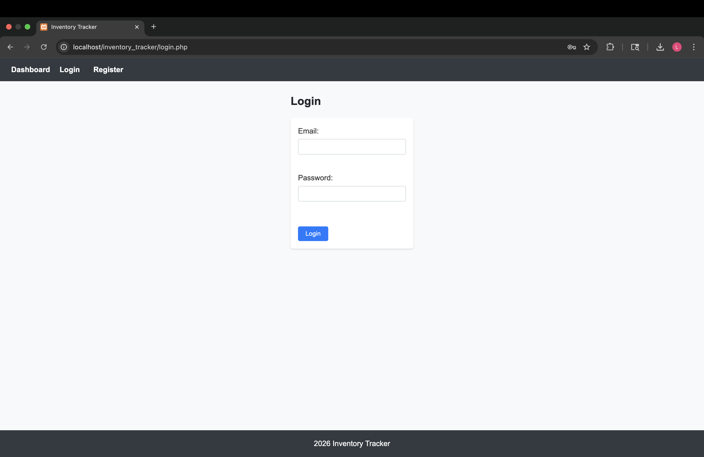
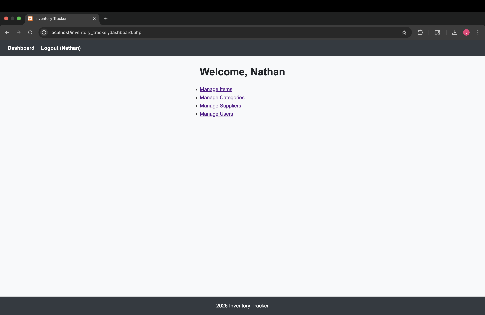
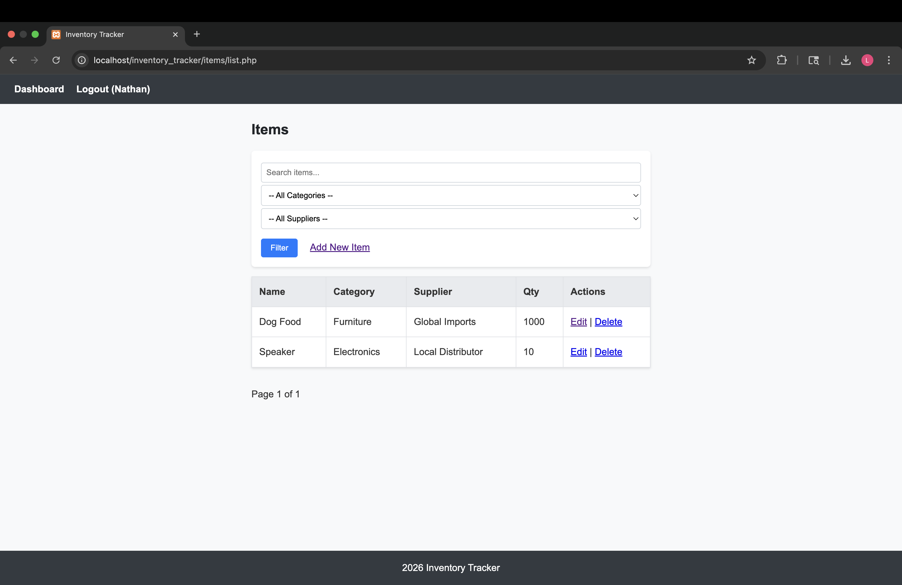

# Inventory Tracker (Full Stack Application)

A full-stack inventory management system built using PHP, MySQL, HTML, and CSS.

## Features
- User authentication (login/register)
- CRUD operations for inventory, categories, and suppliers
- Admin dashboard for managing data
- Modular PHP structure with reusable components

## Tech Stack
- PHP
- MySQL
- HTML/CSS
- XAMPP

## Project Structure
- /admin → admin dashboard functionality
- /items → inventory item management
- /categories → category management
- /suppliers → supplier management
- config.php → database configuration

## How to Run Locally

1. Install XAMPP
2. Move project folder into `htdocs`
3. Start Apache and MySQL
4. Import `database.sql` into phpMyAdmin
5. Go to:
   http://localhost/inventory_tracker

## Purpose
This project was built to practice full-stack development, database design, and CRUD 

## Screenshots

### Login Page

### Dashboard

### Items Management

